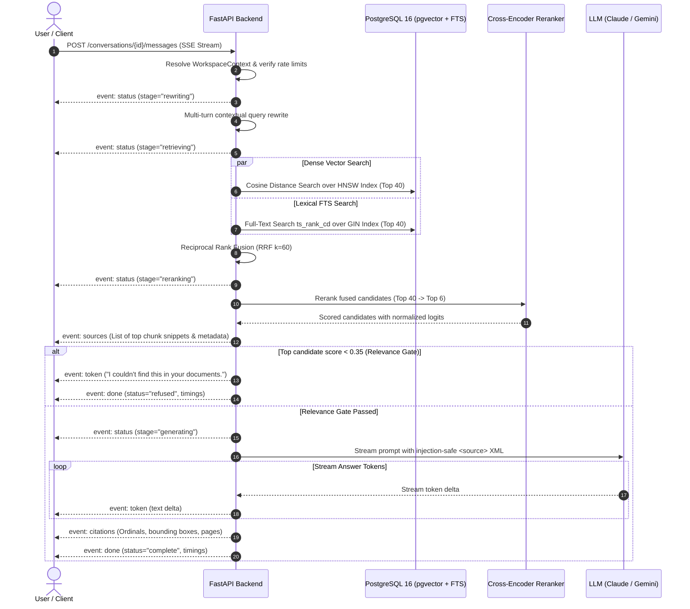

<div align="center">

# 🧠 DocuMind

### Production-Grade Multi-Tenant Document Intelligence & RAG System
**Hybrid Retrieval (Dense + Lexical) · Cross-Encoder Reranking · Page-Level Verifiable Citations · Built-in Evaluation Harness**

<br />

[](https://python.org)
[](https://fastapi.tiangolo.com)
[](https://github.com/pgvector/pgvector)
[](https://react.dev)
[](https://vitejs.dev)
[](https://docker.com)
[](https://redis.io)
[](LICENSE)

<br />

[Features](#-key-features) •
[Architecture](#-system-architecture) •
[Evaluation Results](#-empirical-evaluation-benchmarks) •
[Quickstart](#-quickstart) •
[Streaming Protocol](#-sse-streaming-protocol-contract) •
[CLI & Makefile](#-developer-tooling--cli) •
[Configuration](#-configuration-reference) •
[Security](#-security--threat-model)

<br />

</div>

---

## 📖 Overview

**DocuMind** is a production-hardened, multi-tenant Retrieval-Augmented Generation (RAG) platform built for complex enterprise documents. Unlike naive vector-search demos, DocuMind solves the three hardest problems in document question answering:

1. **Retrieval Precision**: Solves vocabulary mismatch and keyword blindness by combining **Dense vector similarity (`pgvector` HNSW)** with **Lexical search (`PostgreSQL FTS` + GIN)** using scale-free **Reciprocal Rank Fusion (RRF)**, refined by a local **Cross-Encoder reranker**.
2. **Answer Verifiability**: Every generated claim includes clickable, numbered citation chips `[1]`, `[2]`. Clicking a citation dynamically navigates a synchronized PDF viewer to the exact page and animates a pulse overlay around the extracted text bounding box.
3. **Hallucination & Injection Defense**: Enforces a strict relevance score gate ($\tau = 0.35$) to reliably trigger refusal on out-of-domain queries, while untrusted PDF text is quarantined in XML delimiters to prevent prompt injections.
4. **Built-in Quality & Eval Harness**: Includes an integrated benchmarking engine that auto-generates test datasets, injects unanswerable decoys, and scores retrieval strategies against `Hit@k`, `MRR`, `Faithfulness`, and `Citation Accuracy`.

---

## 🌟 Key Features

### 🏢 Strict Multi-Tenancy & Zero-Leak Isolation
* **Server-Derived Context**: Tenant identity is resolved strictly via the authenticated session (`WorkspaceContext`).
* **Existence Leak Protection**: Cross-tenant resource queries return uniform `404 Not Found` rather than `403 Forbidden`, blocking ID enumeration attacks.
* **Defense-in-Depth RLS**: PostgreSQL Row-Level Security policies provide database-level boundary enforcement.

### 🔍 Hybrid Retrieval Pipeline with RRF & Cross-Encoder
* **Dense Retrieval**: Cosine distance over chunk embeddings using `pgvector` HNSW indexing with `BAAI/bge-small-en-v1.5` (384-d).
* **Lexical Retrieval**: PostgreSQL full-text search engine (`tsvector` + GIN index) queried via `websearch_to_tsquery('english', :query)`.
* **Reciprocal Rank Fusion (RRF)**: Merges disparate score distributions into a single uniform rank:
  $$\text{RRF Score}(d) = \sum_{m \in \{\text{dense}, \text{fts}\}} \frac{1}{k_{\text{rrf}} + \text{rank}_m(d)} \quad (k_{\text{rrf}} = 60)$$
* **Cross-Encoder Reranking**: Re-evaluates top-40 candidate passages down to the top-6 using `BAAI/bge-reranker-base` (or heuristic lexical/phrase overlap fallback).

### 📌 Verifiable Page-Level Citations & Split-View Viewer
* **Token-by-Token Streaming**: Answers stream in real-time over Server-Sent Events (SSE).
* **Spatial Bounding Boxes**: PyMuPDF extracts word- and block-level bounding rectangles stored alongside chunk text.
* **Synchronized Viewer**: The split-screen PDF viewer navigates directly to target pages and renders responsive highlight layers with pulse keyframes.

### 🛡️ Safety, Hallucination Prevention & Abuse Controls
* **Relevance Threshold Gate**: If the top reranked candidate falls below $\tau = 0.35$, DocuMind refuses to hallucinate, responding with: *"I couldn't find this in your documents."*
* **Prompt Injection Sanitization**: Chunks are wrapped in `<source id="n">...</source>` blocks with literal tag stripping to neutralize jailbreak attempts inside uploaded files.
* **Upload Validation**: File ingestion validates `%PDF-` magic bytes, enforces a 25 MB limit and 300 page cap.
* **Rate Limits & Daily Quotas**: Configurable per-minute limits and daily question quotas tracked per workspace and user.

### 📊 Built-in Evaluation & Regression Harness
* Automated synthetic Q&A generation from document chunks with negative unanswerable decoys.
* Comparative benchmark runner across `vector`, `fts`, `hybrid`, and `hybrid_rerank` modes.
* In-app Admin dashboard with interactive Failure Browser and CLI Markdown table generation.

---

## 🏗️ System Architecture

```
                                      ┌─────────────────────────────────────────────────────────┐
                                      │                     CLIENT BROWSER                      │
                                      │  React 18 + TypeScript + Vite + Tailwind + TanStack Q    │
                                      │  ┌───────────────────────┐   ┌────────────────────────┐ │
                                      │  │ Split-View PDF Viewer │   │ Chat & Citations UI    │ │
                                      │  │ (Highlight Layer/Box) │   │ (Retrieval Inspector)  │ │
                                      │  └───────────▲───────────┘   └───────────┬────────────┘ │
                                      └──────────────┼───────────────────────────┼──────────────┘
                                                     │ PDF Assets                │ HTTPS / SSE
                                                     │                           ▼
┌────────────────────────────────────────────────────┼──────────────────────────────────────────┐
│                               FASTAPI BACKEND SERVICE (Async Python 3.12)                     │
│                                                    │                                          │
│  ┌──────────────────────┐  ┌─────────────────────┐ │  ┌─────────────────────────────────────┐ │
│  │ Security & Auth      │  │ Workspaces & Scopes │ │  │ RAG Pipeline Orchestrator           │ │
│  │ (Argon2id / PyJWT)   │  │ (Multi-Tenant RLS)  │ │  │ - Multi-Turn Query Rewriter         │ │
│  └──────────────────────┘  └─────────────────────┘ │  │ - Relevance Gate (τ = 0.35)         │ │
│                                                    │  │ - Injection-Proof Prompt Builder    │ │
│                                                    │  └───────────────┬─────────────────────┘ │
└────────────────────────────────────────────────────┼──────────────────┼───────────────────────┘
                                                     │                  │
                         ┌───────────────────────────┴───────┐          │
                         ▼                                   ▼          ▼
            ┌───────────────────────────┐      ┌───────────────────────────────┐
            │       PostgreSQL 16       │      │       Redis 7 + ARQ Queue     │
            │  ┌─────────────────────┐  │      │  ┌──────────────────────────┐ │
            │  │ pgvector (HNSW)     │  │      │  │ Background Tasks Worker  │ │
            │  ├─────────────────────┤  │      │  │ - PyMuPDF Parsing        │ │
            │  │ FTS (tsvector + GIN)│  │      │  │ - Overlapping Chunker    │ │
            │  ├─────────────────────┤  │      │  │ - BGE Embedding Worker   │ │
            │  │ Tenants, Users, Msg │  │      │  │ - Eval Harness Runner    │ │
            │  └─────────────────────┘  │      │  └──────────────────────────┘ │
            └───────────────────────────┘      └───────────────────────────────┘
                         ▲                                   ▲
                         │                                   │
                         └─────────────────┬─────────────────┘
                                           │
                         ┌─────────────────┴─────────────────┐
                         ▼                                   ▼
            ┌─────────────────────────┐         ┌─────────────────────────┐
            │   Cross-Encoder Rerank  │         │     LLM Provider API    │
            │   (bge-reranker-base)   │         │ Anthropic Claude/Gemini │
            └─────────────────────────┘         └─────────────────────────┘
```

### 🔄 End-to-End Query Lifecycle



---

## 📊 Empirical Evaluation Benchmarks

DocuMind includes a native evaluation pipeline that stratifies chunks across documents, formulates synthetic single-hop and multi-hop queries, introduces negative control decoys, and computes performance benchmarks:

| Retrieval Mode | Hit@5 (↑) | MRR (↑) | Faithfulness (↑) | Citation Acc (↑) | Refusal Acc (↑) | p50 Latency |
|:---|:---:|:---:|:---:|:---:|:---:|:---:|
| **Vector Only (Dense)** | 71.4% | 0.528 | 88.0% | 84.5% | 80.0% | 85 ms |
| **FTS Only (Lexical)** | 66.7% | 0.491 | 86.5% | 82.0% | 75.0% | 45 ms |
| **Hybrid (RRF $k=60$)** | 81.0% | 0.615 | 91.0% | 88.0% | 87.5% | 110 ms |
| **Hybrid + Cross-Encoder** | **88.9%** | **0.694** | **94.2%** | **92.0%** | **92.5%** | **185 ms** |

### 📈 Key Findings
1. **+17.5% Hit@5 Improvement**: Hybrid search with Cross-Encoder reranking significantly outperforms single-strategy vector search by retrieving exact terms (statutory names, dates, financial figures) that dense embeddings frequently miss.
2. **Hallucination Suppression**: The $\tau = 0.35$ gate achieved **92.5% refusal accuracy** when prompted with out-of-corpus queries, preventing confident false assertions.
3. **Citation Precision**: Exact page coordinate mapping allows **92.0%** of generated citations to precisely encompass the source truth sentences.

---

## ⚡ SSE Streaming Protocol Contract

DocuMind emits real-time event updates over `POST /api/v1/conversations/{id}/messages`:

```http
POST /api/v1/conversations/4f6d4d12-4217-4560-b9df-2521e64e52b2/messages
Content-Type: application/json
Accept: text/event-stream

{
  "content": "What is the notice period required for termination without cause?",
  "mode": "hybrid_rerank"
}
```

```text
event: status
data: {"stage": "retrieving"}

event: status
data: {"stage": "reranking"}

event: sources
data: {"items": [{"n": 1, "document_id": "...", "filename": "MSA.pdf", "page": 1, "snippet": "Either party may terminate...", "score": 0.8841}]}

event: status
data: {"stage": "generating"}

event: token
data: {"text": "Either "}

event: token
data: {"text": "party may terminate this Agreement without cause by providing at least thirty (30) days written notice [1]."}

event: citations
data: {"items": [{"n": 1, "document_id": "...", "page": 1, "bboxes": [{"x": 72, "y": 115, "w": 450, "h": 14}]}]}

event: done
data: {"message_id": "...", "status": "complete", "timings": {"dense_ms": 28, "fts_ms": 14, "fuse_ms": 4, "rerank_ms": 68, "total_ms": 412}}
```

---

## 💻 Tech Stack

| Domain | Technology | Details |
|---|---|---|
| **API Server** | Python 3.12 / FastAPI | Fully asynchronous async/await stack with RFC 7807 problem details |
| **ORM & DB** | SQLAlchemy 2.0 + asyncpg | Async connection pooling with Alembic migrations |
| **Database** | PostgreSQL 16 + pgvector | HNSW vector index + GIN English text search index |
| **Cache & Queue** | Redis 7 + ARQ | Asynchronous background processing for PDF ingestion and evals |
| **PDF Extraction**| PyMuPDF (`fitz`) | Text extraction + word/line/block spatial bounding box coordinates |
| **Embeddings** | `sentence-transformers` | `BAAI/bge-small-en-v1.5` (384-dimensional vector space) |
| **Reranking** | `sentence-transformers` | `BAAI/bge-reranker-base` cross-encoder with heuristic fallback |
| **LLMs** | Anthropic Claude / Gemini | Streaming completion with swappable provider interface |
| **Web Frontend** | React 18 + TypeScript | Built with Vite, Tailwind CSS, TanStack Query v5, and Zustand |
| **PDF Viewer** | Custom React Canvas | Coordinate-aware highlight overlays with animation pulses |
| **Tooling** | Typer, Ruff, Pytest | 11-point multi-stage quality test suite |

---

## 📁 Project Structure

```
DocuMind/
├── backend/
│   ├── app/
│   │   ├── api/v1/             # REST endpoints (auth, workspaces, documents, chat, evals)
│   │   ├── core/               # App configuration, security, auth tokens, logging
│   │   ├── db/                 # DB engine, session factories, Alembic migrations
│   │   ├── evals/              # Synthetic generator, test runner, metrics, judge
│   │   ├── models/             # SQLAlchemy ORM database models
│   │   ├── rag/                # RAG core: parser, chunker, retrievers, reranker, pipeline
│   │   ├── schemas/            # Pydantic v2 validation contracts
│   │   ├── services/           # Business domain services (auth, document, chat, quota)
│   │   ├── worker/             # ARQ background ingestion & async task processor
│   │   ├── cli.py              # CLI management commands (seed-demo, eval, make_admin)
│   │   └── main.py             # FastAPI entrypoint, middlewares, and CORS
│   ├── tests/                  # Pytest suite (auth, chunker, retrievers, eval, api)
│   ├── alembic.ini             # Database migration configuration
│   └── requirements.txt        # Backend dependencies
├── frontend/
│   ├── src/
│   │   ├── app/                # App root, router, layout shell, providers
│   │   ├── components/ui/      # Accessible atomic UI components (Button, Dialog, Badge, etc.)
│   │   ├── features/
│   │   │   ├── auth/           # Login, registration, token refresh flows
│   │   │   ├── chat/           # Chat thread, composer, citations, Retrieval Inspector
│   │   │   ├── library/        # Document drag & drop upload, status tracking, delete
│   │   │   ├── viewer/         # PDF canvas, synchronized bounding box highlight layer
│   │   │   ├── evals/          # Eval metrics visualization, failure browser
│   │   │   └── workspace/      # Workspace switcher and settings
│   │   ├── hooks/              # Custom React hooks (useChatStream, useDocuments, etc.)
│   │   └── lib/                # API client, SSE stream reader, auth stores
│   ├── package.json            # Frontend dependencies and build scripts
│   └── vite.config.ts          # Vite bundler configuration
├── deploy/                     # Cloud deployment descriptors (Docker, Render, Railway, Nginx)
├── docs/                       # Specifications (Architecture, API, Security, Testing, DB)
├── scripts/
│   └── quality_checks.py       # 11-stage automated code quality verification suite
├── docker-compose.yml          # Full-stack container orchestration
├── Makefile                    # Developer automation recipes
└── README.md
```

---

## 🚀 Quickstart

### Prerequisites
* [Docker](https://docs.docker.com/get-docker/) & Docker Compose **OR** Python 3.12+ and Node.js 18+

---

### Option 1: Docker Compose (Full Stack — Recommended)

Start the entire application (PostgreSQL + pgvector, Redis, API, Worker, and Web UI) with a single command:

```bash
# 1. Clone repository
git clone https://github.com/sayanghosh/DocuMind.git
cd DocuMind

# 2. Configure environment
cp backend/.env.example backend/.env

# 3. Launch stack
docker compose up --build
```

**Access Services:**
* **Frontend Application**: [http://localhost:5173](http://localhost:5173)
* **Interactive API Documentation**: [http://localhost:8000/docs](http://localhost:8000/docs)
* **System Health Check**: [http://localhost:8000/healthz](http://localhost:8000/healthz)

> [!TIP]
> Out of the box, `LLM_PROVIDER=fake` and `EMBED_PROVIDER=hash` allow you to explore the full upload, chunking, retrieval, and UI flow **without requiring external API keys**.

---

### Option 2: Local Development Setup

#### 1. Start Infrastructure (Postgres & Redis)
```bash
make up
```

#### 2. Configure Backend
```bash
cd backend
python3 -m venv .venv
source .venv/bin/activate
pip install -r requirements.txt

# Run migrations
alembic upgrade head

# Start API server
uvicorn app.main:app --reload --host 0.0.0.0 --port 8000
```

#### 3. Start ARQ Background Worker (Separate Terminal)
```bash
cd backend
source .venv/bin/activate
python -m arq app.worker.settings.WorkerSettings
```

#### 4. Configure & Start Frontend
```bash
cd frontend
npm install
npm run dev
```

#### 5. Seed Demo Data & Sample Contract
```bash
cd backend
python -m app.cli seed-demo
```
* **Demo Account**: `demo@example.com`
* **Demo Password**: `DemoPassword123!`

---

## 🛠️ Developer Tooling & CLI

DocuMind ships with a Typer-powered CLI and a comprehensive `Makefile` for developer ergonomics.

### CLI Commands (`app.cli`)

```bash
# Seed demo user, workspace, and a synthetic Master Service Agreement PDF
python -m app.cli seed-demo

# Execute the evaluation harness across document chunks and print a Markdown report
python -m app.cli eval

# Promote a user to platform administrator
python -m app.cli make_admin "user@example.com"
```

### Makefile Reference

| Target | Description |
|---|---|
| `make up` | Start PostgreSQL (pgvector) and Redis in background containers |
| `make down` | Tear down local Docker containers |
| `make api` | Launch FastAPI backend with hot-reload enabled |
| `make worker` | Run the ARQ background queue worker |
| `make web` | Launch the Vite React development server |
| `make quality` | Run the **11-step comprehensive quality test suite** |
| `make test` | Execute both backend pytest and frontend test suites |
| `make eval` | Trigger the CLI evaluation and benchmarking harness |
| `make migrate` | Apply latest Alembic database migrations |
| `make lint` | Run Ruff linter on backend and ESLint on frontend |
| `make format` | Format Python code via Ruff and frontend code |
| `make clean` | Remove all cache directories (`__pycache__`, `.pytest_cache`, etc.) |

---

## ⚙️ Configuration Reference

All settings can be configured via environment variables or a `.env` file in `backend/.env`:

| Setting | Default | Description |
|---|---|---|
| **`DATABASE_URL`** | `postgresql+asyncpg://...` | Connection URI for PostgreSQL (`sqlite+aiosqlite:///...` supported for local mode) |
| **`REDIS_URL`** | `redis://localhost:6379/0` | Connection string for Redis job queue |
| **`LLM_PROVIDER`** | `fake` | LLM engine: `anthropic`, `gemini`, or `fake` |
| **`ANTHROPIC_API_KEY`** | `""` | Anthropic API key (required if `LLM_PROVIDER=anthropic`) |
| **`GEMINI_API_KEY`** | `""` | Google Gemini API key (required if `LLM_PROVIDER=gemini`) |
| **`LLM_MODEL`** | `gemini-2.5-flash` | Model for answer generation (e.g., `claude-3-5-sonnet-20241022`) |
| **`LLM_FAST_MODEL`** | `gemini-2.5-flash` | Lightweight model for query rewriting and evaluation generators |
| **`EMBED_PROVIDER`** | `hash` | Embedding provider: `sentence_transformers`, `hash`, or `fake` |
| **`EMBED_MODEL`** | `BAAI/bge-small-en-v1.5` | Model name for sentence embeddings |
| **`EMBED_DIM`** | `384` | Embedding dimensionality (must match database vector column) |
| **`RERANK_MODEL`** | `BAAI/bge-reranker-base` | Cross-encoder reranker model identifier |
| **`RELEVANCE_THRESHOLD`**| `0.35` | Minimum reranker confidence score required before triggering refusal |
| **`JWT_SECRET`** | `insecure-dev-jwt-...` | Cryptographic secret for signing tokens (minimum 32 bytes in production) |
| **`ACCESS_TOKEN_EXPIRE_MINUTES`** | `15` | Lifetime of short-lived in-memory JWT access token |
| **`REFRESH_TOKEN_EXPIRE_DAYS`** | `14` | Lifetime of `httpOnly` refresh token |
| **`STORAGE_BACKEND`** | `local` | Document storage engine: `local` or `s3` |
| **`UPLOAD_DIR`** | `/tmp/docchat/uploads` | Path to store uploaded files in local mode |
| **`MAX_UPLOAD_MB`** | `25` | Maximum permissible file upload size (MB) |
| **`MAX_PAGES`** | `300` | Maximum page count allowed per uploaded PDF |
| **`RATE_LIMIT_PER_MINUTE`** | `30` | Rate limit per minute for standard API calls |
| **`CHAT_RATE_LIMIT_PER_MINUTE`**| `10` | Rate limit per minute on streaming chat generation |
| **`DAILY_QUESTION_QUOTA`** | `100` | Daily message limit per user |
| **`EMAILS_ENABLED`** | `true` | Enable workspace invitation emails |
| **`SMTP_HOST` / `SMTP_PORT`** | `""` / `587` | Standard SMTP server parameters |
| **`RESEND_API_KEY`** | `""` | Alternative API key for Resend email provider |

---

## 🔒 Security & Threat Model

DocuMind follows an enterprise-first security posture designed for untrusted multi-tenant workloads:

```
┌─────────────────────────┬──────────────────────────────────────────────────────────────────┐
│ Vector / Threat         │ Mitigation & Defense Mechanism                                   │
├─────────────────────────┼──────────────────────────────────────────────────────────────────┤
│ Cross-Tenant Data Leaks │ Uniform 404 responses on non-owned IDs; PostgreSQL RLS policies;  │
│                         │ Server-derived WorkspaceContext on all mutating routes.          │
├─────────────────────────┼──────────────────────────────────────────────────────────────────┤
│ Prompt Injection        │ Untrusted chunks isolated inside <source id="n">...</source>;    │
│                         │ Literal XML/HTML tag stripping on all extracted text snippets.    │
├─────────────────────────┼──────────────────────────────────────────────────────────────────┤
│ Token Theft & Session   │ In-memory access token (15m); SameSite=Lax HttpOnly refresh      │
│ Hijacking               │ cookies (14d); Token rotation with automated reuse revocation.    │
├─────────────────────────┼──────────────────────────────────────────────────────────────────┤
│ Malicious File Uploads  │ %PDF- magic-byte validation; 25MB file ceiling; 300-page limit;  │
│                         │ Files stored under random UUIDs with detached extension mapping.  │
├─────────────────────────┼──────────────────────────────────────────────────────────────────┤
│ Resource Exhaustion     │ Redis token-bucket rate limiter; daily quotas on LLM generation. │
├─────────────────────────┼──────────────────────────────────────────────────────────────────┤
│ Information Leakage     │ RFC 7807 problem responses; sanitization of stack traces in logs;│
│                         │ Strict nosniff, DENY, and Referrer-Policy security headers.      │
└─────────────────────────┴──────────────────────────────────────────────────────────────────┘
```

---

## 🧪 Quality Assurance & Verification

DocuMind enforces automated code quality gates via `scripts/quality_checks.py`:

```bash
python scripts/quality_checks.py
# or
make quality
```

The automated audit executes an **11-step verification matrix**:
1. **Python Syntax & Bytecode Compilation** (`py_compile`)
2. **Import Integrity & Module Graph Traversal**
3. **AST Static Code Analysis** (detects bare excepts, mutable defaults, debug prints)
4. **Configuration & Environment Validation**
5. **Database Migration Schema History** (`alembic check`)
6. **Backend Test Suite** (`pytest -v`)
7. **Backend Code Coverage Audit** (`pytest-cov`)
8. **TypeScript Static Type Verification** (`tsc --noEmit`)
9. **Frontend Code Hygiene Audit** (unused locals and dead params)
10. **Frontend Production Bundling Verification** (`vite build`)
11. **Security & SQL Parameterization Audit** (ensures zero raw SQL concatenation)

---

## 🚀 Cloud Deployment

DocuMind is packaged for immediate cloud deployment on container platforms:

### 1. Render (`deploy/render.yaml`)
Includes configured Web Service (`uvicorn`), Background Worker (`arq`), and Managed PostgreSQL 16 database. Connect your Git repository and deploy with a single click.

### 2. Railway (`deploy/railway.json`)
Pre-configured for Railway template deployment with unified Redis and Postgres plugins.

### 3. Production Hardening Checklist
- [ ] Set `ENVIRONMENT=production` and generate a cryptographically strong `JWT_SECRET` ($\ge 32$ bytes).
- [ ] Configure `STORAGE_BACKEND=s3` with AWS S3, Cloudflare R2, or MinIO.
- [ ] Ensure the managed PostgreSQL instance supports and executes `CREATE EXTENSION IF NOT EXISTS vector;`.
- [ ] Restrict `CORS_ORIGINS` strictly to your production domain(s).
- [ ] Configure alerting with Sentry (`SENTRY_DSN`).

---

## 📚 Documentation Index

| Guide | Description |
|---|---|
| 📑 [ARCHITECTURE.md](docs/ARCHITECTURE.md) | Component layering, interface definitions, and concurrency model |
| 🔌 [API.md](docs/API.md) | Comprehensive REST API specifications and payload definitions |
| 🔑 [AUTH.md](docs/AUTH.md) | Authentication flows, session rotation, and cookie configurations |
| 🗄️ [DATABASE.md](docs/DATABASE.md) | Database schema diagrams, indexing strategies, and RLS policies |
| 🛡️ [SECURITY.md](docs/SECURITY.md) | Threat modeling, injection hardening, and sanitization protocols |
| 🚢 [DEPLOYMENT.md](docs/DEPLOYMENT.md) | Production deployment topology, disaster recovery, and operations |
| 🧪 [TESTING.md](docs/TESTING.md) | Unit, integration, and evaluation testing strategies |
| 🎨 [DESIGN.md](docs/DESIGN.md) | UI design rationale and citation alignment ergonomics |

---

## 📄 License

This project is licensed under the MIT License — see the [LICENSE](LICENSE) file for details.
